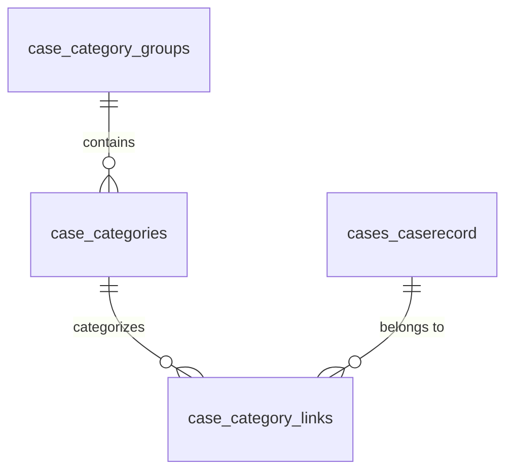
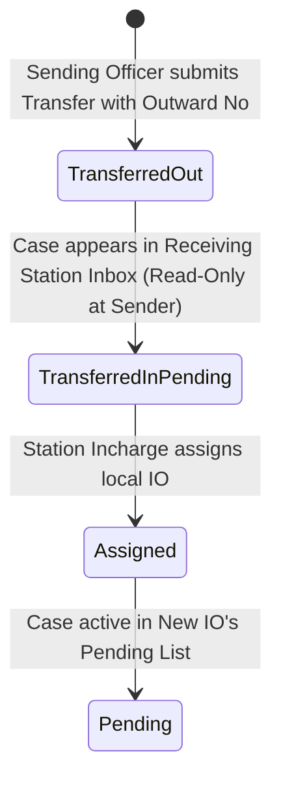

# Police Management System (PMS) — Crime Tab & Common Form Database Architecture

> **Schema:** `maharashtra` (Multi-Tenant State Tenant Schema)  
> **Backend Framework:** Django (REST Framework) + PostgreSQL  
> **Purpose:** Comprehensive operational guide, table definitions, and lifecycle mechanics for Crime Tab grouping, 19 Common Form tables, Dynamic Form Engine, and Inter-Station Case Transfers.

---

## 📑 Table of Contents
1. [Core Grouping & Tab Architecture (§1)](#1-core-grouping--tab-architecture)
2. [19-Table Common Form Database Engine (§2)](#2-19-table-common-form-database-engine)
3. [Dynamic Smart Form Engine (§3)](#3-dynamic-smart-form-engine)
4. [Case Transfer & Handover State Machine (§4)](#4-case-transfer--handover-state-machine)

---

# 1. Core Grouping & Tab Architecture

---

### Table 1: `case_category_groups`
* **Purpose:** Stores the top-level parent crime groups that house multiple sub-tabs on the police dashboard (e.g. **"1 to 5"** and **"Part 6"**).
* **Working Mechanism:** Used by the UI navigation to group 28+ sub-tabs under a single unified dashboard view and compute group-level cumulative counters.

| Column Name | Data Type | Constraints | Description & Business Purpose |
|---|---|---|---|
| `group_id` | `BIGSERIAL` | `PRIMARY KEY` | Unique ID for the crime category group. |
| `group_name` | `VARCHAR(50)` | `NOT NULL` | Human-readable name (e.g. `1 to 5`, `Part 6`). |
| `group_code` | `VARCHAR(10)` | `NULLABLE` | Short legal Roman numeral code (e.g. `I TO V`, `VI`). |
| `display_order` | `INT` | `DEFAULT 0` | Order in which the group card appears in the UI. |
| `created_at` | `TIMESTAMPTZ` | `DEFAULT now()` | Timestamp of record creation. |

---

### Table 2: `case_categories`
* **Purpose:** The master registry of all individual crime sub-tabs (e.g., Murder, Theft, Robbery) and standalone modules (POCSO, NDPS, Suicide, A.D., N.C.).
* **Working Mechanism:**
  - If `group_id` is set, this category renders as a **sub-tab** inside that group page.
  - If `group_id` is `NULL`, this category renders as a top-level **Standalone Tab/Tile**.
  - Dual-presence categories (like *Theft*) have two rows (one with `group_id=1` and one with `group_id=NULL`) sharing the same `template_id`.

| Column Name | Data Type | Constraints | Description & Business Purpose |
|---|---|---|---|
| `category_id` | `BIGSERIAL` | `PRIMARY KEY` | Unique ID for the crime category. |
| `group_id` | `BIGINT` | `FK -> case_category_groups(group_id)` | Parent group ID, or `NULL` if standalone. |
| `category_name` | `VARCHAR(100)` | `NOT NULL` | Sub-tab name (e.g. `Murder`, `Theft`, `POCSO`). |
| `category_code` | `VARCHAR(50)` | `NULLABLE` | Short code (e.g. `101`, `STAND_THEFT`). |
| `template_id` | `BIGINT` | `FK -> field_templates(template_id)` | Baseline dynamic form template for this category. |
| `display_order` | `INT` | `DEFAULT 0` | Sort order on the dashboard/sub-tab bar. |
| `is_active` | `BOOLEAN` | `DEFAULT TRUE` | Active status toggle. |
| `created_at` | `TIMESTAMPTZ` | `DEFAULT now()` | Timestamp of record creation. |

---

### Table 3: `case_category_links`
* **Purpose:** Many-to-Many link table that connects a `CaseRecord` to one or more `case_categories`.
* **Working Mechanism:** Solves the **Dual-Tab requirement**. When a case is filed under *Theft*, it is linked to both the *"1 to 5"* Theft sub-tab and the Standalone Theft tab. Both screens query this table to list cases and count live metrics without copying or duplicating any case records.

| Column Name | Data Type | Constraints | Description & Business Purpose |
|---|---|---|---|
| `link_id` | `BIGSERIAL` | `PRIMARY KEY` | Unique link ID. |
| `case_id` | `VARCHAR(128)` | `FK -> cases_caserecord(id) ON DELETE CASCADE` | Linked case identifier. |
| `category_id` | `BIGINT` | `FK -> case_categories(category_id) ON DELETE CASCADE` | Linked category identifier. |
| `is_primary` | `BOOLEAN` | `DEFAULT FALSE` | Flags the primary category if multiple apply. |
| `created_at` | `TIMESTAMPTZ` | `DEFAULT now()` | Timestamp of link creation. |

---

# 2. 19-Table Common Form Database Engine

```mermaid
graph TD
    CR[cases_caserecord]
    CR --> T1[crime_registration_info]
    CR --> T5[crime_case_acts_sections]
    CR --> T6[crime_spot]
    CR --> T7[stolen_property]
    CR --> T8[recovered_property]
    CR --> T9[cases_person]
    CR --> T10[crime_case_responsibility]
    CR --> T11[arrest_release_status]
    CR --> T12[procedural_details]
    CR --> T13[seizure_records]
    CR --> T14[technical_custody]
    CR --> T15[preventive_actions]
    CR --> T16[discharge_status]
    CR --> T17[court_filing]
    CR --> T18[scrutiny_pipeline]
    CR --> T19[final_verdict]
```

---

### Table 4: `crime_registration_info` (§1)
* **Purpose:** Stores core FIR registration details (1:1 with CaseRecord).
* **Working Mechanism:** Captures the mandatory Crime/FIR number, official registration date, uploaded scanned FIR PDF/image path, and narrative summary of the offence.

| Column Name | Data Type | Constraints | Description |
|---|---|---|---|
| `info_id` | `BIGSERIAL` | `PRIMARY KEY` | Primary key. |
| `case_id` | `VARCHAR(128)` | `UNIQUE, FK -> cases_caserecord(id)` | 1:1 link to case. |
| `cr_no` | `VARCHAR(100)` | `NOT NULL` | FIR / C.R. Number (e.g. `102/2026`). |
| `reg_date` | `DATE` | `NULLABLE` | Date FIR was registered. |
| `fir_copy_path` | `TEXT` | `NULLABLE` | Cloud storage URL or file path of FIR copy. |
| `brief_description` | `TEXT` | `NULLABLE` | Core narrative/gist of the registered offence. |

---

### Table 5: `acts` (§2)
* **Purpose:** Master list of criminal laws and acts (e.g., BNS 2023, IPC 1860, NDPS, POCSO, Arms Act).
* **Working Mechanism:** Serves as the source of truth for the Acts dropdown/chips selector in the form.

| Column Name | Data Type | Constraints | Description |
|---|---|---|---|
| `act_id` | `BIGSERIAL` | `PRIMARY KEY` | Primary key. |
| `act_code` | `VARCHAR(50)` | `UNIQUE, NOT NULL` | Short code (e.g. `BNS`, `IPC`, `NDPS`). |
| `act_name` | `VARCHAR(255)` | `NOT NULL` | Full name of the Act. |
| `is_active` | `BOOLEAN` | `DEFAULT TRUE` | Active toggle. |

---

### Table 6: `act_sections` (§2)
* **Purpose:** Master catalog of sections under each Act (e.g. Section 103 under BNS, Section 302 under IPC).
* **Working Mechanism:** Loaded dynamically when an Act is selected. Defines bailable status and links to dynamic extra form templates.

| Column Name | Data Type | Constraints | Description |
|---|---|---|---|
| `section_id` | `BIGSERIAL` | `PRIMARY KEY` | Primary key. |
| `act_id` | `BIGINT` | `FK -> acts(act_id)` | Parent Act. |
| `section_number` | `VARCHAR(50)` | `NOT NULL` | Section number (e.g. `103`, `303`, `376`). |
| `title` | `VARCHAR(255)` | `NULLABLE` | Offence title (e.g. `Murder`, `Theft`). |
| `bailable_type` | `VARCHAR(50)` | `DEFAULT 'Non-Bailable'` | Bail eligibility classification. |

---

### Table 7: `act_subsections` (§2)
* **Purpose:** Granular subsection catalog per legal section (e.g. `(1)`, `(2)(a)`).

---

### Table 8: `crime_case_acts_sections` (§2)
* **Purpose:** Records all charges and sections filed on a specific case (1:N repeating).
* **Working Mechanism:** Stores multiple charges per case. When a new charge is inserted here, the Dynamic Form Engine inspects `section_id` to unlock extra field templates (Trigger B).

| Column Name | Data Type | Constraints | Description |
|---|---|---|---|
| `id` | `BIGSERIAL` | `PRIMARY KEY` | Primary key. |
| `case_id` | `VARCHAR(128)` | `FK -> cases_caserecord(id)` | Case ID. |
| `act_id` | `BIGINT` | `FK -> acts(act_id)` | Applied Act. |
| `section_id` | `BIGINT` | `FK -> act_sections(section_id)` | Applied Section. |
| `is_major` | `BOOLEAN` | `DEFAULT TRUE` | Major vs minor charge distinction. |

---

### Table 9: `crime_spot` (§3)
* **Purpose:** Stores the exact physical crime scene location (1:1 with CaseRecord).
* **Working Mechanism:** Holds village/town, area name, street address, and optional GPS coordinates for crime mapping.

---

### Table 10: `stolen_property` & Table 11: `recovered_property` (§4)
* **Purpose:** Tracks stolen items vs recovered items with valuations and serial numbers (1:N repeating).
* **Working Mechanism:** Automatically calculates recovery percentage and stores seizure linkage for property returns (Muddemal).

---

### Table 12: `cases_person` (§5-12)
* **Purpose:** Unified KYC profile for every individual involved in a case (Complainant, Victim, Deceased, Injured, Accused, Suspect, Unidentified, Unknown).
* **Working Mechanism:**
  - Standardizes Demographics (Name, Age, Gender, Occupation, Mobile, Aadhaar, PAN, Religion, Caste, Address).
  - Handles specialized role fields: Medical examination flags for victims, Inquest details for deceased, and physical markers for unidentified criminals.
  - Linked to downstream arrest, remand, discharge, and verdict tables.

---

### Table 13: `crime_case_responsibility` (§13)
* **Purpose:** 1:1 table tracking Investigating Officer (IO), FIR Registrar, and CCTV evidence availability.

---

### Table 14: `arrest_release_status` (§14)
* **Purpose:** Tracks arrest, custody, notice (BNSS 35 / CrPC 41A), and bail release status per accused person (1:N).
* **Working Mechanism:** Implements D.K. Basu guidelines (relative informed, notice issued, wanted/absconding flag).

---

### Table 15: `procedural_details` (§15)
* **Purpose:** Panchanama checklist (Spot, Memorandum, Inquest, Search, Personal Search, ID Parade, Exhumation) with dates and panch witness names.

---

### Table 16: `seizure_records` (§16)
* **Purpose:** Records property seizures, recovery status, and custodial location (Malkhana, FSL, Court).

---

### Table 17: `technical_custody` (§17)
* **Purpose:** Consolidated digital evidence and remand custody suite (1:1 with CaseRecord).
* **Working Mechanism:**
  - Tracks mandatory **E-Shakshya** digital audio-video recordings and reason validation if skipped (min 30 words).
  - Tracks **Fingerprint/Biometrics** collection.
  - Tracks **CDR** (Call Detail Record) requests and receipts.
  - Tracks **PCR** (Police Custody Remand) and **MCR** (Magisterial Custody Remand) days and jail names.
  - Tracks **Bail & Surety KYC** details.

---

### Table 18: `preventive_actions` (§18)
* **Purpose:** Tracks preventive bond proceedings (BNSS 126 / 129 / Bond Cancellation) and bond values.

---

### Table 19: `discharge_status` (§19)
* **Purpose:** Per-accused discharge records under court orders with validated legal justification (min 20 words).

---

### Table 20: `court_filing` (§20)
* **Purpose:** Charge Sheet number, filing date, court name, and magistrate details (1:1 with CaseRecord).

---

### Table 21: `scrutiny_pipeline` (§21)
* **Purpose:** Implements the 3-tier sequential supervisory approval workflow:
  1. **Tier 1:** SDPO / ACP Approval
  2. **Tier 2:** APP (Assistant Public Prosecutor) Scrutiny
  3. **Tier 3:** Addl SP / DCP / Addl CP Final Clearance

---

### Table 22: `final_verdict` (§22)
* **Purpose:** Records trial numbers (CC/ST No.), High Court quashing orders, summary classifications (A/B/C/Abated), and individual conviction/acquittal verdicts per accused.

---

# 3. Dynamic Smart Form Engine

### Dynamic Engine Tables:
1. **`field_templates`**: Container for groups of form fields.
2. **`field_template_fields`**: Defines individual dynamic UI controls (text, number, date, dropdown, checkbox, chips, file) and keys.
3. **`category_field_overrides`**: Allows hiding normally common fields for specific sub-tabs.
4. **`section_field_templates`**: Maps legal sections (e.g. Theft 303, Murder 103) to extra field templates.
5. **`case_extra_field_values`**: Stores non-standard dynamic answers in key-value format per case.

---

# 4. Case Transfer & Handover State Machine

### Table 23: `case_transfers`
* **Purpose:** Permanent audit log and workflow state machine for inter-station and Zero FIR case handovers.

| Column Name | Data Type | Description |
|---|---|---|
| `transfer_id` | `BIGSERIAL PK` | Unique transfer identifier. |
| `case_id` | `VARCHAR(128) FK` | Transferred case. |
| `from_station_name` | `VARCHAR(255)` | Source sending police station. |
| `to_station_name` | `VARCHAR(255)` | Destination target police station. |
| `transfer_reason` | `VARCHAR(100)` | Zero FIR / Jurisdiction Correction / Crime Branch / Court Order. |
| `outward_no` | `VARCHAR(100)` | Official police station outward dispatch number. |
| `outward_date` | `DATE` | Dispatch date. |
| `order_memo_path` | `TEXT` | Uploaded transfer directive order copy. |
| `status` | `VARCHAR(32)` | `transferred_out` ➔ `transferred_in_pending` ➔ `assigned`. |
| `assigned_to_io_name` | `VARCHAR(255)` | Local IO assigned by destination in-charge. |

---

## 🚀 Summary
This architecture provides:
1. **100% Data Integrity:** Every case aspect is isolated in dedicated tables with relational foreign keys.
2. **Zero Redundancy:** Dual-presence tabs share data through `case_category_links`.
3. **Smart Adaptation:** Dynamic form engine adjusts inputs without losing typed values.
4. **Complete Auditability:** Case transfers maintain a permanent, unalterable chain of custody across police stations.
